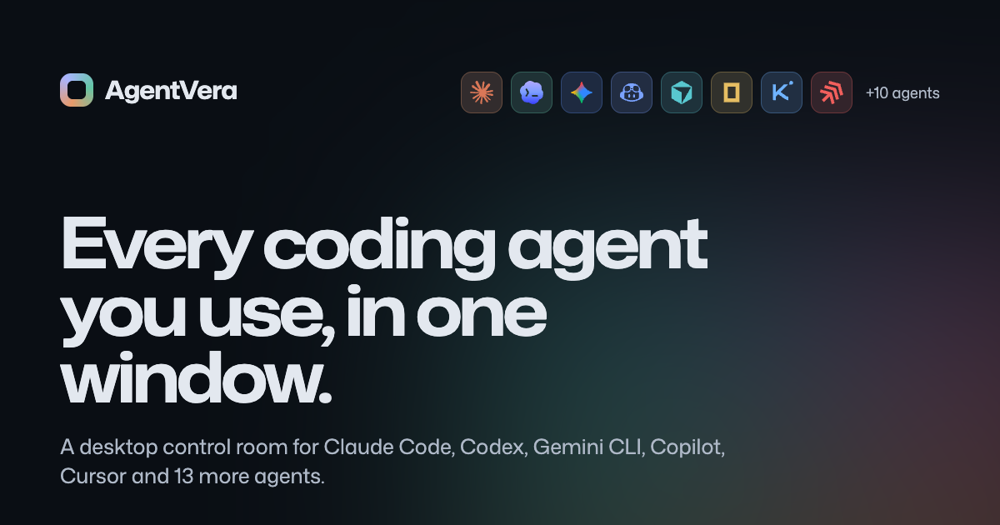

  

<h1 align="center">AgentVera</h1>

  <b>Run Claude Code, Codex, Gemini CLI, Copilot and 14 more AI coding agents side by side, on macOS, Windows and Linux.</b> 
  <a href="https://agentvera.dev/en/">Website</a> ·
  <a href="https://agentvera.dev/en/download/">Download</a> ·
  <a href="https://agentvera.dev/en/features/">Features</a> ·
  <a href="https://agentvera.dev/en/pricing/">Pricing</a> ·
  <a href="https://agentvera.dev/en/blog/">Blog</a> ·
  <a href="#türkçe">Türkçe</a>

---

AgentVera is a desktop app that runs the coding agents already installed on your computer in real terminals, side by side, per project. Every agent uses its own CLI and its own login (your Claude Pro/Max or ChatGPT plan works as is; no API key needed), and AgentVera adds what is missing between them: layouts, git worktrees, flows, reviews, limits and cost.

This repository is AgentVera's public home: **releases, issues and feature requests**. The app itself is closed source.

## Supported agents

Claude Code · Codex · Gemini CLI · GitHub Copilot CLI · Cursor Agent · Antigravity · opencode · Hermes · Qwen Code · Kimi Code · Kiro · Amp · Factory Droid · Goose · Mistral Vibe · Crush · Aider · Cline, plus plain terminals for any other CLI. [One page per agent →](https://agentvera.dev/en/agents/)

## What it does

- **Parallel agents, one window.** Grids from 1×1 to 5×4, agent groups with their own layout and shared notice board, an optional git worktree per agent, and a warning when two agents edit the same file.
- **Work between agents.** [Flows](https://agentvera.dev/en/features/flows/) pass one agent's reply to the next; a [research → plan → build](https://agentvera.dev/en/features/research-plan-build/) pipeline; [night shift](https://agentvera.dev/en/features/night-shift/) runs queued tasks overnight and opens draft PRs.
- **Quality.** Automatic [code review](https://agentvera.dev/en/features/code-review/) when a turn ends, acceptance checks (Verify), [checkpoints and replay](https://agentvera.dev/en/features/checkpoints-and-replay/), and a project map (a tree-sitter code graph over MCP) so agents find the right files without reading the repo.
- **Limits and cost.** [Account switching](https://agentvera.dev/en/features/account-switching/) when a 5-hour or weekly limit runs low, context profiles, automatic `/compact`, bundled [RTK](https://github.com/rtk-ai/rtk) that compresses shell output before it reaches the model, and an "Automatic" model that picks Haiku, Sonnet or Opus per task.
- **Tools agents need.** [MCP manager](https://agentvera.dev/en/features/mcp-manager/), [database manager](https://agentvera.dev/en/features/database-manager/), [SSH/SFTP](https://agentvera.dev/en/features/ssh-and-sftp/) with per-host rules, Docker, an API client, an agent browser, and a [runner](https://agentvera.dev/en/runner/) for agents on your own server.
- **Teams.** Organizations, a [team kanban](https://agentvera.dev/en/features/teams-and-kanban/) whose cards go to your running agents, invite-only customer boards and [webhooks](https://agentvera.dev/en/webhooks/).

Your code, conversations and settings stay on your computer; agents talk to their own providers under your accounts.

## Download

| Platform | Installer |
| --- | --- |
| macOS (Apple silicon) | [AgentVera-mac-arm64.dmg](https://agentvera.dev/downloads/latest/AgentVera-mac-arm64.dmg) |
| macOS (Intel) | [AgentVera-mac-x64.dmg](https://agentvera.dev/downloads/latest/AgentVera-mac-x64.dmg) |
| Windows (x64) | [AgentVera-win-x64.exe](https://agentvera.dev/downloads/latest/AgentVera-win-x64.exe) |
| Linux (x64) | [AppImage](https://agentvera.dev/downloads/latest/AgentVera-linux-x86_64.AppImage) · [.deb](https://agentvera.dev/downloads/latest/AgentVera-linux-amd64.deb) |

The app updates itself. Core features are free with unlimited agents; Pro and Team plans add flows, the pipeline, night shift, auto approval, account switching, the database manager and team features. [Compare plans →](https://agentvera.dev/en/pricing/)

## Alternatives and comparisons

Looking at Conductor, Vibe Kanban, Claude Squad, Nimbalyst or Superset? See the side-by-side comparisons at [agentvera.dev/en/alternatives](https://agentvera.dev/en/alternatives/).

## Feedback

- **Bug or crash:** [open an issue](../../issues/new?template=bug.yml)
- **Idea or missing agent:** [request a feature](../../issues/new?template=feature.yml)

---

## Türkçe

**AgentVera; Claude Code, Codex, Gemini CLI, Copilot ve 14 kodlama ajanını daha macOS, Windows ve Linux'ta yan yana çalıştıran bir masaüstü uygulaması.** Her ajan bilgisayarındaki kendi CLI'ıyla ve kendi hesabınla, gerçek bir terminalde çalışır; Claude ya da ChatGPT aboneliğin olduğu gibi kullanılır, API anahtarı gerekmez. AgentVera aralarındaki işi yönetir: düzenler, git worktree'ler, akışlar, kod incelemesi, limitler ve token tasarrufu.

[Türkçe site](https://agentvera.dev/) · [İndir](https://agentvera.dev/indir/) · [Özellikler](https://agentvera.dev/ozellikler/) · [Fiyatlar](https://agentvera.dev/fiyatlar/) · [Alternatifler](https://agentvera.dev/alternatifler/)

Hata ve önerilerini bu depodaki Issues bölümüne yazabilirsin.

---

AgentVera is built by <a href="https://solviera.com.tr">Solviera Teknoloji</a>. Claude, Codex, Gemini and other names are trademarks of their owners; AgentVera is not affiliated with them.
